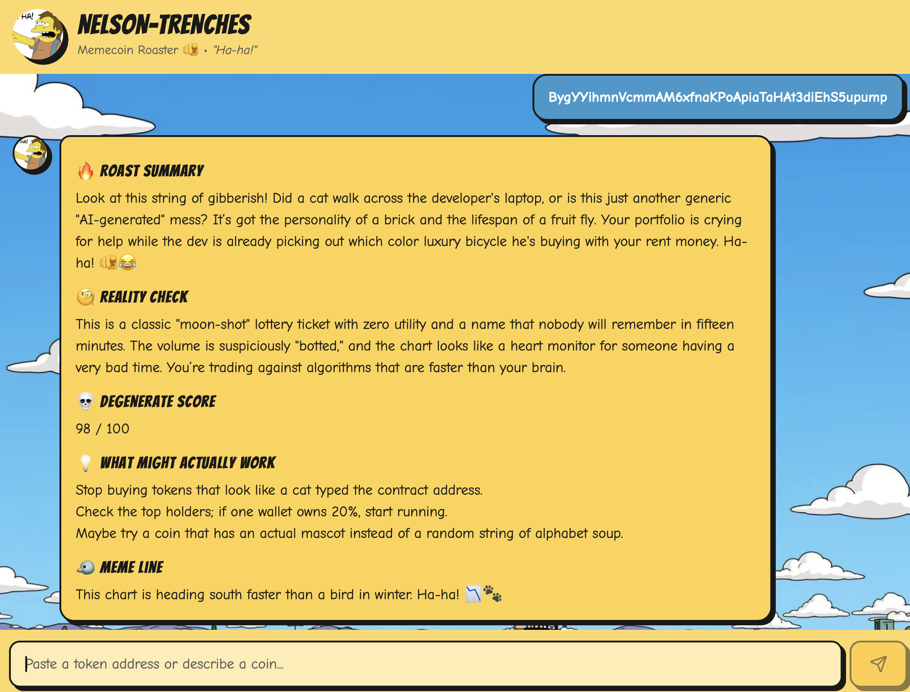

# 🫵 Nelson's Nudge

[](https://opensource.org/licenses/MIT)
[](https://www.typescriptlang.org/)
[](https://reactjs.org/)
[](https://tailwindcss.com/)

Nelson's Nudge is an AI-powered conversational assistant that analyzes Solana tokens and memecoins with a unique sense of humor inspired by Nelson Muntz from The Simpsons.

## 🌐 Live Demo

**[Try it now →](https://nelson-s-nudge.vercel.app)**



## 🎯 Features

- **Solana Token Analysis**: Enter a token name, contract address, or describe a memecoin launch
- **Intuitive Chat Interface**: Modern and responsive UI built with React and Tailwind CSS
- **Streaming Responses**: Get real-time responses through AI streaming
- **Insightful Analysis**: Nelson provides humorous yet informative analyses of crypto projects

## 🚀 Technologies Used

- **Frontend**: React 18, TypeScript, Vite
- **UI/UX**: Tailwind CSS, shadcn/ui, Lucide React
- **Backend**: Supabase Edge Functions
- **State Management**: React Query (@tanstack/react-query)
- **Forms**: React Hook Form with Zod validation
- **Markdown**: React Markdown for message rendering

## 📦 Installation

```sh
# Clone the repository
git clone https://github.com/solingo-learn/nelson-s-nudge.git

# Navigate to the project directory
cd nelson-s-nudge

# Install dependencies
npm install

# Create a .env file with your environment variables
# See .env.example for the required structure
cp .env.example .env

# Start the development server
npm run dev
```

## 🔧 Configuration

Create a `.env` file at the root of the project with the following variables:

```env
VITE_SUPABASE_PROJECT_ID=your_project_id
VITE_SUPABASE_PUBLISHABLE_KEY=your_publishable_key
VITE_SUPABASE_URL=your_supabase_url
```

## 📝 Available Scripts

- `npm run dev`: Start the development server
- `npm run build`: Build the project for production
- `npm run preview`: Preview the production build
- `npm run lint`: Check code with ESLint
- `npm test`: Run tests
- `npm run test:watch`: Run tests in watch mode

## 🎨 UI Components

The project uses a comprehensive library of UI components based on Radix UI and shadcn/ui:

- Accordion, Alert Dialog, Avatar
- Button, Card, Checkbox
- Dialog, Dropdown Menu, Form
- Input, Label, Select
- Tabs, Toast, Tooltip
- And many more...

## 🤝 Contributing

Contributions are welcome! Feel free to open an issue or submit a pull request.

See [CONTRIBUTING.md](CONTRIBUTING.md) for more details.

## 📄 License

This project is open source and available under the MIT License.

## ⚠️ Disclaimer

This tool is for educational and entertainment purposes only. Do not make investment decisions based solely on the analyses provided. Always Do Your Own Research (DYOR) before investing in cryptocurrencies.

---

Built with ❤️ for the Solana crypto community
